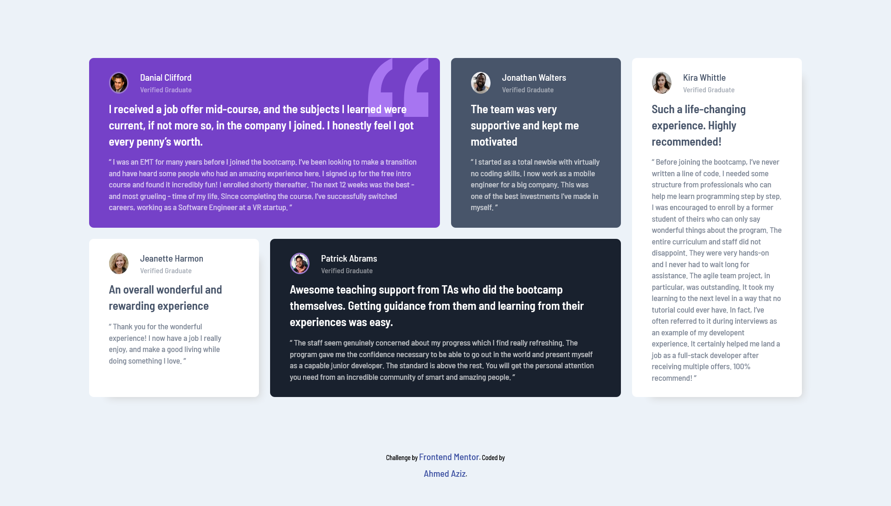

# Frontend Mentor - Testimonials grid section solution

This is a solution to the [Testimonials grid section challenge on Frontend Mentor](https://www.frontendmentor.io/challenges/testimonials-grid-section-Nnw6J7Un7). Frontend Mentor challenges help you improve your coding skills by building realistic projects.

## Table of contents

- [Overview](#overview)
  - [Screenshot](#screenshot)
  - [Links](#links)
- [My process](#my-process)
  - [Built with](#built-with)
- [Author](#author)
- [Acknowledgments](#acknowledgments)

## Overview

### The challenge

Users should be able to:

- See hover and focus states for all interactive elements on the page

### Screenshot

### Links

- Solution URL: [Solution Repo](https://github.com/Abo3bazez/Testimonials-Grid-Section-Main)
- Live Site URL: [Live Site](https://abo3bazez.github.io/Testimonials-Grid-Section-Main/)

## My process

### Built with

- HTML5 markup
- CSS custom properties
- Flexbox
- Mobile-first workflow
- SASS
- Normalize CSS Library
- Bootstrap Breakpoints

## Author

- Twitter - [Ahmed Aziz](https://twitter.com/Abo_3bazez)
- Frontend Mentor - [Ahmed Aziz](https://www.frontendmentor.io/profile/Abo3bazez)
- GitHub - [Ahmed Aziz](https://github.com/Abo3bazez)

## Acknowledgments

Osama Elzero - Elzero Web School
